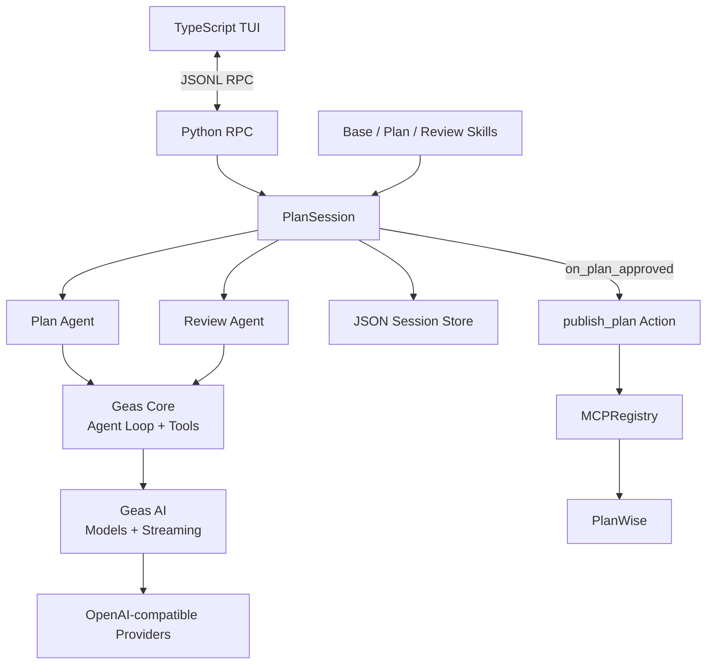

# Geas

Geas 是一个使用 Python 实现的轻量级 Plan/Review Agent。它参考 pi 的核心
分层思想，将模型适配、Agent Loop 和上层规划工作流分开，并通过 TypeScript
TUI 提供交互入口。

项目当前包含：

- 统一的消息、模型、Provider 和流式事件协议；
- 支持工具循环、取消和错误传播的 Agent Core；
- 相互隔离的 Plan Agent 与 Review Agent；
- Skill 渐进式披露和 MCP 远程工具调用；
- JSON Session 持久化与恢复；
- 审批通过后确定性发布到 PlanWise；
- 单阶段 Eval、Token 和成本记录。

## 架构



| 模块 | 职责 |
| --- | --- |
| `geas/ai` | 统一模型、消息、内容块、流式事件和 Provider 调用 |
| `geas/core` | Agent 状态、Agent Loop、工具执行和事件流 |
| `geas/plan_agent` | Plan/Review 状态机、Profile、Skill 和 Session |
| `geas/actions` | 由程序流程确定性触发的动作 |
| `geas/mcp.py` | MCP 连接、认证和通用远程工具调用 |
| `geas/rpc.py` | 组装各层，并通过 JSONL 与 TUI 通信 |
| `tui` | 基于 `pi-tui` 的终端交互界面 |

## 本地运行

要求：

- Python 3.12+
- [uv](https://docs.astral.sh/uv/)
- Node.js 22.19+

安装依赖：

```bash
uv sync
npm --prefix tui ci
```

启动：

```bash
uv run python main.py
```

首次进入后：

1. 使用 `/model` 分别选择 PLAN 和 REVIEW 模型；
2. 使用 `/login` 保存对应 Provider 的 API Key；
3. 输入目标，开始规划。

常用命令：

| 命令 | 作用 |
| --- | --- |
| `/model` | 配置 Plan/Review 模型 |
| `/login` | 保存 Provider API Key |
| `/new` | 创建新 Session |
| `/resume` | 恢复当前项目的历史 Session |
| `/quit` | 退出 |

## 环境变量

也可以复制示例配置后直接编辑：

```bash
cp .env.example .env
```

PLAN 和 REVIEW 必须分别配置 Provider 与 Model；没有配置时 Geas 会明确报错，
不会使用隐式默认值。

PlanWise MCP 是可选集成。启用后，Review Agent 批准计划时，Geas 会使用
Session ID 作为幂等键调用 `create_plan`：

```dotenv
GEAS_MCP_PLANWISE_URL=http://127.0.0.1:8000/mcp
GEAS_MCP_PLANWISE_TOKEN=<access token>
```

## Skill

Skill 按适用阶段放置：

```text
skills/
├── base/
├── plan/
└── review/
```

Geas 首先只向模型提供 Skill 的名称、描述和位置；模型需要时再通过
`read_skill` 读取完整 `SKILL.md`。

Skill 启用的 Bash Tool 会在 Geas 当前运行环境中执行命令。不要直接运行
不可信 Skill；需要隔离时使用容器，并严格控制挂载目录和凭据。

## 测试与 Eval

```bash
uv run pytest -q
npm --prefix tui run build
```

运行真实模型的单阶段 Eval：

```bash
uv run python -m evals.single_phase
```

临时覆盖 Eval 模型：

```bash
uv run python -m evals.single_phase \
  --provider deepseek \
  --model deepseek-v4-flash
```

结果默认保存到 `eval-results/single-phase/`，包括每个 Case 的检查结果、
Token、成本和汇总通过率。使用 `--no-save` 可以只打印结果。

## Docker

准备 `.env` 后运行：

```bash
docker compose run --rm geas
```

Compose 会只读挂载 `skills/`，并使用命名卷保存 Session。Docker 提供基础隔离，
但不是针对恶意代码的完整安全沙盒。

## 当前边界

- 目前只实现 OpenAI-compatible 文本模型；
- 图片输入和 OAuth Token 自动刷新尚未实现；
- Session 只支持单进程写入；
- Eval 是小型基线，不代表生产环境质量保证。

