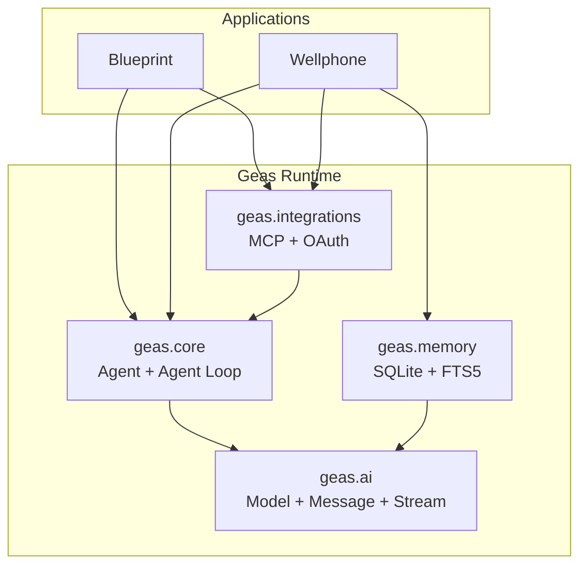

# Geas

Geas 是一个 Python LLM Agent Runtime，为两个真实应用提供统一的模型调用、流式事件、Agent Loop、Tool 执行、MCP 集成与长期记忆能力。

项目参考 [Pi](https://github.com/earendil-works/pi) 的核心抽象边界，但不是对 TypeScript 源码的逐行翻译；重点是用符合 Python 习惯的方式复现可组合的 Agent Runtime。

## 应用

| 项目 | 用途 | 重点能力 |
| --- | --- | --- |
| [Blueprint](apps/blueprint/) | 将目标转化为经过独立评审和人工确认的可执行计划 | 双 Agent 工作流、结构化输出、Session、Skill、Eval |
| [Wellphone](apps/wellphone/) | 由 Server 端 Agent 调用 iPhone 原生能力和外部服务 | Tool Broker、长轮询、幂等投递、权限与审批、MCP、Memory |

两个应用直接组合 Geas 的模块，没有额外的 BaseAgent、注册中心或多 Agent 框架。

## 核心能力

| 模块 | 职责 |
| --- | --- |
| `geas.ai` | 统一消息、模型、流式事件和 OpenAI-compatible Provider Adapter；内置 DeepSeek、Qwen、Kimi、GLM 模型目录 |
| `geas.core` | 有状态 Agent、Agent Loop、Tool 参数校验、生命周期 Hooks 和细粒度运行事件 |
| `geas.integrations` | MCP Streamable HTTP Client、Tool Adapter、allowlist、Bearer Token 与 OAuth 2.0 授权 |
| `geas.memory` | 使用 SQLite 保存原始 Turn、提取 facts/events，并通过 FTS5 检索相关记忆 |

## 架构



模型响应被转换为统一事件流；Agent Loop 累积消息、校验并执行 Tool Call，再把结果送回模型。上层应用通过 Hooks、Tools 和状态机定义自己的产品行为，而 Runtime 不依赖任何具体产品。

## 关键设计选择

| 问题 | 选择 | 取舍 |
| --- | --- | --- |
| 如何复用 Agent 能力 | 分离 `ai`、`core`、`integrations` 和 `memory` | 模块边界更清楚，但当前仍作为单仓库内部包发布 |
| 如何接入不同模型 | 统一 OpenAI-compatible 流式接口并注册模型目录 | 接入同协议模型简单，暂未覆盖其他 Provider 协议 |
| 如何执行工具 | JSON Schema 校验后顺序执行，并发出完整生命周期事件 | 行为确定、便于 Trace；同一轮多个 Tool Call 不并行 |
| 如何扩展外部能力 | MCP Tool 动态发现后转换为 `AgentTool` | 复用标准协议，但调用方仍需配置 allowlist 和审批边界 |
| 如何保存长期记忆 | SQLite + FTS5，本地提取和按需检索 | 部署简单，适合单机应用；不支持分布式共享 |

## 运行方式

要求 Python 3.12+ 和 [uv](https://docs.astral.sh/uv/)。Blueprint TUI 还需要 Node.js 22.19+；Wellphone iOS Client 需要 macOS、Xcode 26 和 iOS 26 真机。

```bash
git clone https://github.com/weii2000/GeasAI.git
cd GeasAI
uv sync
```

应用启动方式和环境变量分别见 [Blueprint README](apps/blueprint/) 与 [Wellphone README](apps/wellphone/)。密钥只通过本地 `.env` 或专门的凭据存储提供，不写入源码。

## 验证方式

```bash
uv run pytest -q
npm --prefix apps/blueprint/tui ci
npm --prefix apps/blueprint/tui run build
```

除单元与集成测试外，两个应用分别维护面向 Agent 行为的 Eval Suite，用于检查 Tool 选择、参数、状态转换、安全边界和虚假完成声明。

## 当前边界

- Provider Adapter 当前只覆盖 OpenAI-compatible 文本模型；
- Runtime 是本仓库内部包，尚未提供稳定的独立版本与兼容性承诺；
- Session、OAuth Token 和长期记忆均为单机持久化；
- Agent Eval 是小型回归基线，不代表生产环境质量保证。
