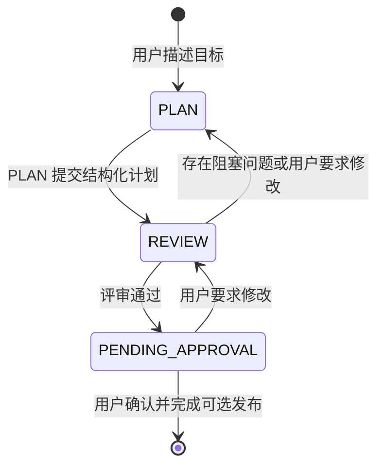
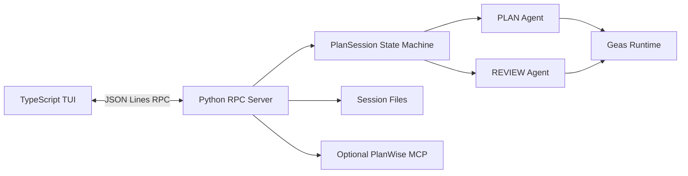

# Blueprint

Blueprint 是基于 [Geas Runtime](../../) 构建的计划 Agent，将用户目标依次转化为经过目标澄清、结构化规划、独立评审和人工确认的可执行计划。

它使用两个职责分离的 Agent：PLAN Agent 负责理解目标并修改计划，REVIEW Agent 独立检查完整性、约束和可验收性。模型不能绕过最终的人类确认直接发布结果。

## 核心能力

| 能力 | 当前实现 |
| --- | --- |
| 双 Agent 工作流 | PLAN 和 REVIEW 使用独立模型、上下文、Tool 与最大轮数 |
| 结构化计划 | Tool 更新标题、目标、说明、验收标准、约束和嵌套任务 |
| 独立评审 | Review Report 记录问题、证据和严重程度；阻塞问题退回 PLAN |
| 人工审批 | Review 通过后进入 `PENDING_APPROVAL`，由用户批准或要求修改 |
| Session | 保存 Agent 消息、计划、评审报告和阶段，可通过 `/resume` 恢复 |
| Skill | 按 base/plan/review 分组，先加载元数据，需要时读取完整内容 |
| 可选发布 | 人工确认后发布到 PlanWise，并使用 Session ID 作为幂等键 |
| Eval | 独立运行 PLAN 或 REVIEW 阶段，检查 Tool、状态、计划内容和错误 |

## 架构





TUI 与 Python 进程只通过结构化 RPC 交互。`PlanSession` 是工作流状态的唯一入口，Agent 通过 Tool 修改业务对象，而不是依赖自然语言解析最终计划。

## 关键设计选择

| 问题 | 选择 | 取舍 |
| --- | --- | --- |
| 如何避免同一 Agent 自我评审 | PLAN 与 REVIEW 使用独立 Agent 和阶段 Tool | 多一次模型调用，但职责和失败位置更清楚 |
| 如何保证输出可执行 | 计划与评审都由类型化 Tool 更新 | 比解析 Markdown 稳定，但 Tool Schema 需要维护 |
| 如何控制阶段切换 | `PlanSession` 显式状态机 | 流程确定；暂不支持任意工作流编排 |
| 如何扩展领域知识 | Skill 元数据按阶段暴露，正文按需读取 | 减少默认上下文；不可信 Skill 仍可能带来执行风险 |
| 如何发布外部结果 | Review 通过后仍需人工确认，Session ID 作为幂等键 | 防止静默写入；当前只支持 PlanWise |

## 运行方式

要求 Python 3.12+、[uv](https://docs.astral.sh/uv/) 和 Node.js 22.19+。从仓库根目录运行：

```bash
uv sync
npm --prefix apps/blueprint/tui ci
cp apps/blueprint/.env.example apps/blueprint/.env
uv run python -m apps.blueprint.main
```

首次启动后使用 `/model` 配置 PLAN 和 REVIEW 模型，使用 `/login` 保存 Provider API Key 或登录 PlanWise。

| 命令 | 用途 |
| --- | --- |
| `/model` | 分别选择 PLAN 和 REVIEW 的 Provider 与模型 |
| `/login` | 配置 Provider API Key 或 PlanWise 登录 |
| `/new` | 创建新的计划 Session |
| `/resume` | 恢复当前项目保存的 Session |
| `/quit` | 退出 TUI |

核心环境变量：

| 变量 | 用途 | 必要性 |
| --- | --- | --- |
| `GEAS_PLAN_PROVIDER` / `GEAS_PLAN_MODEL` | PLAN Agent 模型 | 必需 |
| `GEAS_REVIEW_PROVIDER` / `GEAS_REVIEW_MODEL` | REVIEW Agent 模型 | 必需 |
| `<PROVIDER>_API_KEY` | 对应 Provider 凭据 | 必需，可通过 `/login` 写入 |
| `GEAS_MCP_PLANWISE_URL` / `GEAS_MCP_PLANWISE_TOKEN` | PlanWise MCP 与可选 Bearer Token | 否 |

完整配置见 [`.env.example`](.env.example)。Session 默认保存在 `~/.geas/sessions/<project>-<hash>/`，并按当前项目目录隔离。

Skill 位于 `apps/blueprint/skills/`。Skill 的 Bash Tool 会在当前环境直接执行，因此不要在宿主机加载不可信 Skill。

## 验证方式

```bash
uv run pytest tests/test_plan_agent.py tests/test_skills.py tests/test_evals.py -q
npm --prefix apps/blueprint/tui run build
uv run python -m apps.blueprint.evals.single_phase
```

Eval Suite v0.4 包含 8 个代表性案例，覆盖模糊目标澄清、完整计划提交、评审通过、阻塞问题退回、用户反馈路由和约束违反。Eval 需要有效的模型凭据，结果默认写入 `eval-results/blueprint/single-phase/`。

## 当前边界

- 当前工作流固定为 PLAN、REVIEW 和人工确认三个阶段；
- PlanWise 是唯一发布目标，未配置时确认只结束 Session，不写入外部系统；
- Skill 的 Bash Tool 没有进程级沙箱，安全边界依赖运行环境；
- Session 是本地文件存储，不支持多进程并发编辑或远端同步；
- Eval 是小型回归基线，不代表计划质量的完整保证。
